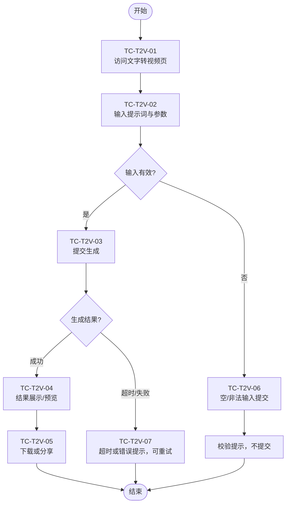

# Visiva AI App 测试用例（流程图）

**文档版本：** V1.0  
**产品名称：** Visiva AI  
**被测地址：** https://visiva.ai/app  
**关联方案：** Visiva_APP_测试方案.md  

> 以下各模块测试用例以流程图形式描述，节点旁标注用例编号（如 TC-HOME-01），便于与用例明细对照。

---

## 一、应用首页（/app）

| 编号 | 测试点 | 预期结果 |
|------|--------|----------|
| TC-HOME-01 | 页面加载 | 页面正常展示，无白屏、严重错位 |
| TC-HOME-02 | 主导航 | 正确跳转至对应功能页 |
| TC-HOME-03 | 热门模板展示 | 模板列表/卡片正常展示，可点击 |
| TC-HOME-04 | 模板跳转 | 进入对应创作流程或详情页 |

---

## 二、文字转视频（Text to Video）

| 编号 | 测试点 | 预期结果 |
|------|--------|----------|
| TC-T2V-01 | 页面可访问 | 页面加载，输入区可见 |
| TC-T2V-02 | 提示词输入 | 可输入、可修改，参数可选 |
| TC-T2V-03 | 生成任务提交 | 有提交反馈，进入排队或生成中状态 |
| TC-T2V-04 | 生成结果展示 | 有视频预览或明确完成/失败提示 |
| TC-T2V-05 | 下载/分享 | 可下载或跳转分享流程 |
| TC-T2V-06 | 空/非法输入 | 有校验提示，不误提交 |
| TC-T2V-07 | 长时间等待/失败 | 有超时或错误提示，可重试 |

---

## 三、图片转视频（Image to Video）

| 编号 | 测试点 | 预期结果 |
|------|--------|----------|
| TC-I2V-01 | 页面可访问 | 页面加载，上传区可见 |
| TC-I2V-02 | 图片上传 | 支持约定格式，上传成功有预览 |
| TC-I2V-03 | 参数/动效设置 | 参数可调，说明清晰 |
| TC-I2V-04 | 生成与结果 | 有进度或状态，完成后可预览视频 |
| TC-I2V-05 | 下载 | 可下载生成视频 |
| TC-I2V-06 | 大文件/异常格式 | 有大小/格式限制提示 |
| TC-I2V-07 | 替换/删除图片 | 可重新选择，状态正确 |

---

## 四、视频延长（Video Extend）

| 编号 | 测试点 | 预期结果 |
|------|--------|----------|
| TC-VE-01 | 页面可访问 | 页面加载，上传区可见 |
| TC-VE-02 | 视频上传 | 支持约定格式，上传成功有预览/时长信息 |
| TC-VE-03 | 延长参数 | 参数可选，逻辑合理 |
| TC-VE-04 | 生成与结果 | 有状态反馈，完成后可预览延长后视频 |
| TC-VE-05 | 下载 | 可下载 |
| TC-VE-06 | 格式/时长限制 | 有明确限制提示 |

---

## 五、AI SPICY（Video AI — NSFW 内容生成）

> 本模块用于生成 NSFW（Not Safe For Work / 成人向）内容，测试需覆盖年龄校验、访问控制及内容策略合规。

| 编号 | 测试点 | 预期结果 |
|------|--------|----------|
| TC-SPY-01 | 访问与年龄/身份校验 | 未满龄或未通过校验时不可进入，有明确限制提示；通过后可进入（New 标签入口可见） |
| TC-SPY-02 | NSFW 模板选择 | 可选成人向模板/风格，说明与警示清晰 |
| TC-SPY-03 | 素材/参数 | 可上传素材或填写参数，符合内容策略要求 |
| TC-SPY-04 | 提交生成 | 有提交反馈，进入生成状态；违规内容被拒绝时有提示 |
| TC-SPY-05 | 预览与下载 | 生成完成后可预览、下载；成品符合平台 NSFW 与合规策略 |

---

## 六、AI 特效 / 视频特效（Video Effects）

| 编号 | 测试点 | 预期结果 |
|------|--------|----------|
| TC-EFF-01 | 特效列表页 | 特效/模板列表正常展示 |
| TC-EFF-02 | 特效分类与筛选 | 列表更新正确 |
| TC-EFF-03 | 选择特效并应用 | 进入生成流程，参数可配置 |
| TC-EFF-04 | 生成与预览 | 可预览、可下载 |
| TC-EFF-05 | 热门模板入口 | 进入对应特效或模板流程 |

---

## 七、图生图（Image to Image）— Image AI

| 编号 | 测试点 | 预期结果 |
|------|--------|----------|
| TC-I2I-01 | 页面可访问 | 页面加载，上传区可见（Image AI 入口） |
| TC-I2I-02 | 图片上传 | 支持约定格式，上传成功有预览 |
| TC-I2I-03 | 参数/风格设置 | 参数可调，说明清晰 |
| TC-I2I-04 | 提交生成 | 有提交反馈，生成完成后可预览 |
| TC-I2I-05 | 预览与下载 | 可预览、下载生成图片 |

---

## 八、文生图（Text to Image）— Image AI

| 编号 | 测试点 | 预期结果 |
|------|--------|----------|
| TC-T2I-01 | 页面可访问 | 页面加载，输入区可见（Image AI 入口） |
| TC-T2I-02 | 提示词与参数 | 可输入、可修改，参数可选 |
| TC-T2I-03 | 提交生成 | 有提交反馈，进入生成状态 |
| TC-T2I-04 | 结果展示 | 有图片预览或完成/失败提示 |
| TC-T2I-05 | 预览与下载 | 可预览、下载生成图片 |

---

## 九、我的作品（My Creations）

| 编号 | 测试点 | 预期结果 |
|------|--------|----------|
| TC-MC-01 | 页面可访问 | 侧栏进入，作品列表或空状态正常展示 |
| TC-MC-02 | 列表与筛选 | 作品按时间/类型展示，筛选（若有）正确 |
| TC-MC-03 | 预览作品 | 可点击预览，视频/图片正常播放或展示 |
| TC-MC-04 | 下载 | 可下载已生成作品 |
| TC-MC-05 | 删除/管理 | 可删除或管理作品（若有），状态同步 |

---

## 十、购买积分 / 升级（Upgrade Now）

> 购买积分有两种方式：① **Get Extra Credits**（一次性积分包）；② **Upgrade to get more credits**（订阅 Pro/Basic，月付/年付）。入口为侧栏「Upgrade Now」。

| 编号 | 测试点 | 预期结果 |
|------|--------|----------|
| TC-CRD-01 | Upgrade Now 入口 | 侧栏点击「Upgrade Now」可打开购买/升级弹窗（Get Extra Credits 或 Upgrade to get more credits） |
| TC-CRD-02 | Get Extra Credits 弹窗 | 标题「Get Extra Credits」、副标题「Top up your balance and continue creating」、弹窗正常展示 |
| TC-CRD-03 | 积分包套餐与价格 | 6 档套餐（如 200/600/1000/2000/5000/12000 Credits）及对应价格、标签（Best value、Limited-time offer）正确展示 |
| TC-CRD-04 | 有效期与 Buy Now | 文案「Credits will be valid with 2 years」及 (i) 说明可见；每档有「Buy Now」按钮，点击可进入支付或跳转 |
| TC-CRD-05 | 积分包弹窗关闭 | 点击右上角 X 可关闭弹窗，无异常 |
| TC-CRD-06 | Upgrade 弹窗 | 标题「Upgrade to get more credits」、弹窗正常展示 |
| TC-CRD-07 | 月付/年付切换 | 「Monthly」「Yearly」可切换；年付展示「Save 50%」；价格随切换正确变化（如 Pro 月付 $29.99、年付 $14.99/月 等） |
| TC-CRD-08 | Pro / Basic 套餐 | Pro：1,200 Credits/月、约 60 视频/月；Basic：500 Credits/月、约 25 视频/月；年付显示总积分（如 14,400 / 6,000） |
| TC-CRD-09 | Supported Features | 左侧 Supported Features 列表（Text to Video、Image to video、Video Extend、3 Parallel tasks、Unlock all Visiva models、Watermark removal 等）与勾选正确展示 |
| TC-CRD-10 | 订阅 Buy Now 与关闭 | 各套餐「Buy Now」可点击并进入支付或跳转；右上角 X 可关闭弹窗 |

---

## 十一、登录与注册（Log in / Sign Up）

> **登录页**（Log in to Visiva）：Google 登录、邮箱/密码、忘记密码、Sign up for free、条款与关闭。**注册页**（Sign Up for Visiva AI）：邮箱与密码、Create account、Already have an account? Login、条款与关闭。

### 登录（Log in to Visiva）

| 编号 | 测试点 | 预期结果 |
|------|--------|----------|
| TC-LOG-01 | 登录页可访问与展示 | 标题「Log in to Visiva」、Visiva Logo、右上角 X；弹窗或页面正常展示 |
| TC-LOG-02 | Sign in with Google | 「Sign in with Google」按钮可点击，跳转 Google 授权或完成登录 |
| TC-LOG-03 | 邮箱与密码输入 | 「Email Address」「Password」可输入、可清空；「Or」分隔线展示正确 |
| TC-LOG-04 | 密码可见性切换 | 密码框旁眼睛图标可切换显示/隐藏密码 |
| TC-LOG-05 | Login 按钮提交 | 输入有效账号密码后点击「Login」可登录成功；错误时有提示 |
| TC-LOG-06 | Sign up for free | 「Sign up for free」链接可跳转至注册页（Sign up 高亮） |
| TC-LOG-07 | Forgot your password? | 「Forgot your password?」链接可跳转找回密码流程 |
| TC-LOG-08 | 条款与关闭 | 底部「By logging in you agree with our Terms of Use and Privacy Policy」可见；点击 X 可关闭弹窗 |

### 注册（Sign Up for Visiva AI）

| 编号 | 测试点 | 预期结果 |
|------|--------|----------|
| TC-REG-01 | 注册页可访问与展示 | 标题「Sign Up for Visiva AI」、Logo、「Already have an account? Login」、右上角 X；页面正常展示 |
| TC-REG-02 | 邮箱与密码输入 | 「Your Email」「Enter your password」可输入；密码框眼睛图标可切换可见性 |
| TC-REG-03 | Create account 提交 | 输入有效邮箱与密码后点击「Create account」可完成注册；格式错误或重复时有提示 |
| TC-REG-04 | Login 入口 | 「Already have an account?」下「Login」链接可跳转至登录页 |
| TC-REG-05 | 条款与隐私 | 底部「By clicking Create account, I agree that I have read and accepted the Terms of Use and Privacy Policy」可见且可点链接 |
| TC-REG-06 | 关闭 | 点击右上角 X 可关闭注册弹窗或返回 |

---

## 十二、手机端浏览器兼容性（Mobile Browser）

> 本版支持手机端浏览器访问，需在手机浏览器（如 Safari iOS、Chrome Android）或 PC 开发者工具模拟手机视口下，验证布局、导航与核心流程可用。

| 编号 | 测试点 | 预期结果 |
|------|--------|----------|
| TC-MOB-01 | 手机端访问首页 | 在手机浏览器打开 https://visiva.ai/app，首页正常加载，无白屏、严重错位或横向溢出 |
| TC-MOB-02 | 侧栏/导航展示与折叠 | 侧栏或主导航在手机端以折叠/汉堡菜单等形式展示，可展开收起；各入口（Home、Video AI、Image AI、My Creations、Upgrade Now）可点击进入 |
| TC-MOB-03 | 核心功能页可访问 | 文字转视频、图片转视频、视频延长、AI 特效、图生图、文生图、我的作品等页面在手机端可正常打开，布局适配竖屏 |
| TC-MOB-04 | 输入与上传 | 提示词输入框、图片/视频上传在手机端可用；键盘弹出与收起无遮挡或错位；可从相册/相机选择文件（若支持） |
| TC-MOB-05 | 生成与预览/下载 | 提交生成后状态/进度可见，生成完成后可预览视频/图片；下载或分享在手机端可用 |
| TC-MOB-06 | 登录/注册与购买弹窗 | 登录、注册、Get Extra Credits、Upgrade 等弹窗在手机端可正常打开与关闭；表单可输入，按钮可点击，无严重遮挡 |
| TC-MOB-07 | 触控与滚动 | 触控点击、长按、滑动滚动正常；列表与卡片可滚动，无卡顿或误触 |
| TC-MOB-08 | 横竖屏与分辨率 | 常见竖屏分辨率（如 375×667、390×844）下布局正常；横屏切换（若支持）无错乱；不同机型/浏览器表现一致 |

---

## 十三、账号与权益（若本期包含）

| 编号 | 测试点 | 预期结果 |
|------|--------|----------|
| TC-ACC-01 | 免费入口 | 可进入使用或登录/注册页 |
| TC-ACC-02 | 登录/注册 | 登录态正确，可正常使用受保护功能 |
| TC-ACC-03 | 额度/次数展示 | 展示正确，用完后有明确提示 |

---

## 十四、通用与合规

| 编号 | 测试点 | 预期结果 |
|------|--------|----------|
| TC-GEN-01 | FAQ/帮助 | 内容可读、链接有效 |
| TC-GEN-02 | 条款与隐私 | 页面可访问，内容符合产品说明 |
| TC-GEN-03 | 内容策略提示 | 有拒绝或提示，不生成违规结果 |
| TC-GEN-04 | 水印与版权 | 符合产品说明（如「无水印」或「AI 生成」标识） |

---

## 用例汇总

| 模块 | 用例数 | 用例编号范围 |
|------|--------|--------------|
| 应用首页 | 4 | TC-HOME-01 ~ TC-HOME-04 |
| 文字转视频 | 7 | TC-T2V-01 ~ TC-T2V-07 |
| 图片转视频 | 7 | TC-I2V-01 ~ TC-I2V-07 |
| 视频延长 | 6 | TC-VE-01 ~ TC-VE-06 |
| AI SPICY | 5 | TC-SPY-01 ~ TC-SPY-05 |
| AI 特效 | 5 | TC-EFF-01 ~ TC-EFF-05 |
| 图生图 | 5 | TC-I2I-01 ~ TC-I2I-05 |
| 文生图 | 5 | TC-T2I-01 ~ TC-T2I-05 |
| 我的作品 | 5 | TC-MC-01 ~ TC-MC-05 |
| 购买积分 / 升级 | 10 | TC-CRD-01 ~ TC-CRD-10 |
| 登录与注册 | 14 | TC-LOG-01 ~ TC-LOG-08，TC-REG-01 ~ TC-REG-06 |
| 账号与权益 | 3 | TC-ACC-01 ~ TC-ACC-03 |
| 手机端浏览器兼容性 | 8 | TC-MOB-01 ~ TC-MOB-08 |
| 通用与合规 | 4 | TC-GEN-01 ~ TC-GEN-04 |
| **合计** | **88** | — |

---

### 页面链接（执行用例时可直接访问）

| 模块 | URL |
|------|-----|
| 应用首页 | https://visiva.ai/app |
| 文字转视频 | https://visiva.ai/app/text-to-video |
| 图片转视频 | https://visiva.ai/app/image-to-video |
| AI SPICY | https://visiva.ai/app/ai-spicy |
| 视频延长 | https://visiva.ai/app/video-extend |
| AI 特效 | https://visiva.ai/app/video-effects |
| 图生图 | https://visiva.ai/app/image-to-image |
| 文生图 | https://visiva.ai/app/text-to-image |
| 我的作品 | https://visiva.ai/app/creations |
| 购买积分 / 升级 | 侧栏「Upgrade Now」入口（弹窗，无独立 URL） |
| 登录与注册 | 弹窗或独立页（从需登录能力处触发，如 Get Start for FREE、使用受保护功能时） |
| 手机端浏览器兼容性 | 同上述各 URL，在手机浏览器或 PC 开发者工具手机模拟下访问 |

---

### 流程图说明

- **矩形**：操作/检查步骤，框内为用例编号与简要动作。
- **菱形**：判断节点（如输入是否有效、生成是否成功）。
- **虚线**：可选或并行入口（如从首页直接进入某模板）。
- 各图下方表格保留「编号 + 测试点 + 预期结果」，便于执行时对照。

在支持 Mermaid 的编辑器中（如 VS Code、GitHub、Typora）打开本文件可渲染流程图；不支持时可使用 [Mermaid Live Editor](https://mermaid.live) 粘贴代码块预览。
